# [**Go Back**](https://github.com/lukebinmore/guideshare-api)

# **Table Of Contents**
- [**Go Back**](#go-back)
- [**Table Of Contents**](#table-of-contents)
- [**Deployment**](#deployment)
  - [**Step 1: Cloning Repository**](#step-1-cloning-repository)
  - [**Step 2: Get Cloudinary API Key**](#step-2-get-cloudinary-api-key)
  - [**Step 3: Deploy to Heroku**](#step-3-deploy-to-heroku)
  - [**Step 4: Updating Admin Details**](#step-4-updating-admin-details)
  - [**Access Deployed App**](#access-deployed-app)

***

# **Deployment**

This project has been deployed using Heroku. Please see below for instructions on how to clone and deploy this project for your own use.

## **Step 1: Cloning Repository**

Before it can be deployed, the repository needs to be cloned to you own Github account so that it can be interacted with.

 - Step 1 - Login or Signup to [GitHub](https://github.com/).
   - Head to [github.com](https://github.com/).
   - Select Sign Up if you don't have an account, or Sign In if you do from the top right corner of the page. Enter your credentials, or create your new account.
   - 
 - Step 2 - Navigate to the Project Page.
   - Head to [Project Page](https://github.com/lukebinmore/guideshare-api).
 - Step 3 - Fork the repository.
   - Select the Fork option in the top right of the window.
   - 
   - Fill in the form, providing your new repository name and optional description.
   - Click Create Fork when ready.
   - 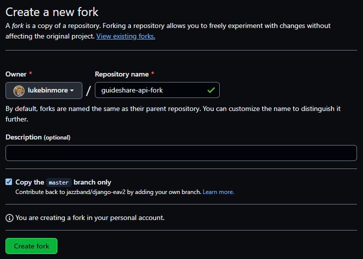

***

## **Step 2: Get Cloudinary API Key**

After forking the repository to your own account, we can create a Cloudinary Account for the site to use and gather the required API key.

 - Step 1 - Login or Signup to [Cloudinary](https://cloudinary.com/)
   - Head to [cloudinary.com](https://cloudinary.com/).
   - Select Sign Up if you don't have an account, or Login if you do from the top right corner of the page. Enter your credentials, or create your new account.
   - 
 - Step 2 - Copy API Environment Variable
   - From the dashboard, locate the API Environment variable, and copy it, This will be entered later on into Heroku's environment variables.
   - 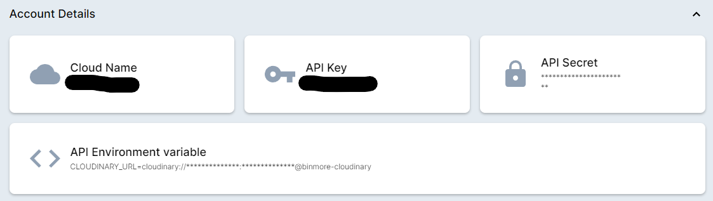

***

## **Step 3: Deploy to Heroku**

After setting up Cloudinary, we now have the information and accounts required to deploy the project to Heroku.

- Step 1 - Login or Signup to [Heroku](https://www.heroku.com/)
  - Head to [heroku.com](https://www.heroku.com/).
  - Select Sign Up if you don't have an account, or Sign In if you do from the top right corner of the page. Enter your credentials, or create your new account.
  - 
- Step 2 - Create a New App.
  - From the Dashboard, select the New option in the top right corner of the window. Then select create new app.
  - 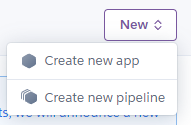
  - Enter a name for the app, and choose the closest reigon. Then select Create App.
  - 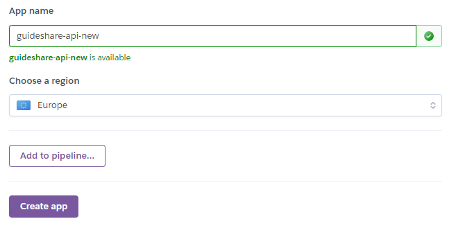
- Step 3 - Setup Heroku-Postgres
  - After creating your new app, select the resources tab at the top of the window.
  - 
  - In the Add-ons search section, search for Heroku Postgres.
  - 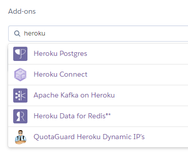
  - Select Heroku Postgres. In the form that opens, select Hobby Dev - Free from the Plan name options. Then select the Submit Order Form.
  - 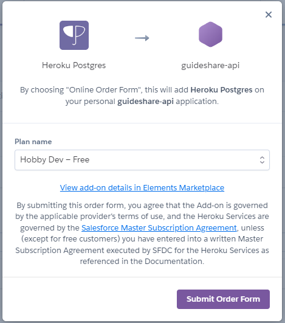
- Step 4 - Set up Environment Variables
  - Select the Settings option from the navigation bar at the top of the window.
  - 
  - Select Reveal Config Vars.
  - 
  - In the available KEY and VALUE fields, add the below variables without the speachmarks and select Add for each entry. The DATABASE_URL should alrady exist, as we setup the Postgres database already.
  - 
    - KEY: "ALLOWED_HOST" - VALUE: "YOUR HEROKU APP NAME.herokuapp.com"
    - KEY: "CLIENT_ORIGIN" - VALUE: "URL FOR YOUR DEPLOYED FRONT END"
    - KEY: "CLOUDINARY_URL" - VALUE: "CLOUDINARY URL FROM CLOUDINARY"
    - KEY: "DATABASE_URL" - VALUE: "YOUR POSTGRES URL"
    - KEY: "SECRET_KEY" - VALUE: "A SECURE SECRET KEY OF YOUR CHOOSING"
- Step 5 - Link GitHub Repository.
  - Select the Deploy option from the navigation bar at the top of the window.
  - 
  - Select GitHub from the selection of deployment methods.
  - 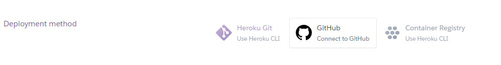
  - Select the option to connect Heroku to Github, and sign in with your GitHub details.
  - In the repo-search, enter the name of your github repository and select search. Select Connect on the correct repository.
  - 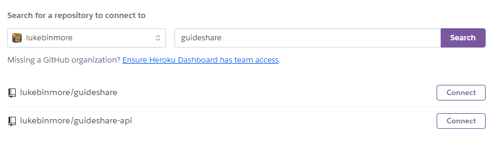
- Step 6 - Deploy
  - Select the option to Deploy Branch at the bottom of the page, for the first run to ensure deployment is successful.
  - 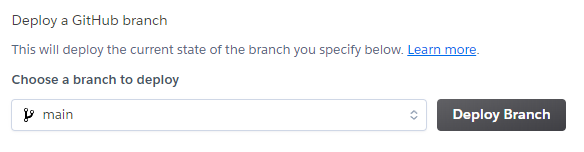
  - After the deployment succeeds, select the Enable Automatic Deploys option to enable automatic deploys of future updates to the repository.
  - 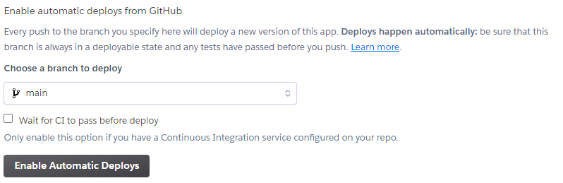

***

## **Step 4: Updating Admin Details**

Now that the project has been deployed, a super user will be required to provide Admin access to the site and backend database.

 - Step 1 - Navigate to the Console.
   - On your Heroku app Overview, select the More option in the top right corner of the window, then select the Run Console option.
   - 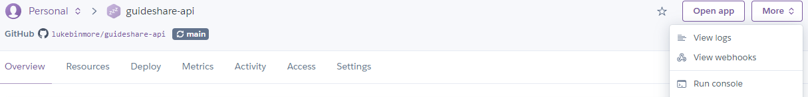
   - In the heroku run prompt that opens, enter the following command without the speachmarks, then select Run:
     - "python manage.py createsuperuser"
   - 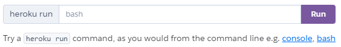
   - In the terminal window that opens, follow the prompts to create a new super user. The details provided here can be used to login to the admin site at the published app URL.
   - 

***

## **Access Deployed App**

With all of the above complete, our app is live and ready for use. To access the admin page from the heroku dashboard, select the open option from within your apps overview section.

***